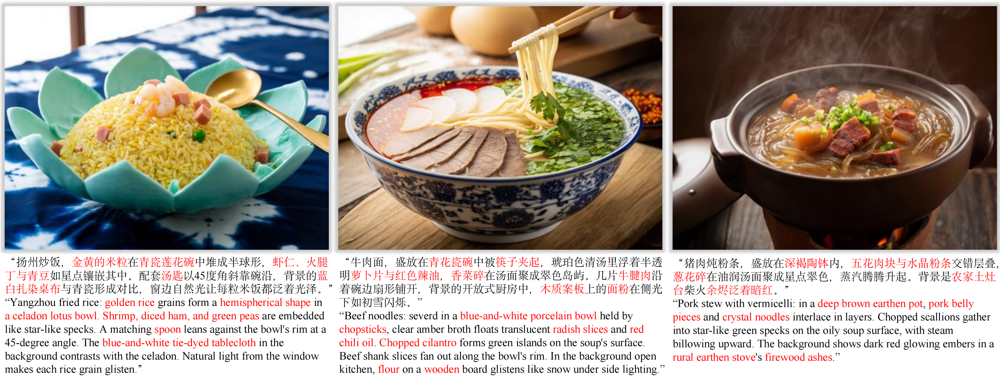

<h3 align="center">
    Omni-Dish: Photorealistic and Faithful Image Generation and Editing for Arbitrary Chinese Dishes
</h3>

<p align="center"> 
<a href="https://liuhuijie6410.github.io/OmniDish/"></a> 
<a href="https://github.com/LiuHuijie6410/OmniDish"></a> 
<a href="https://arxiv.org/abs/2504.09948"></a>
<a href="https://huggingface.co/datasets/liuhuijie6410/OmniDish-Edit-70K"></a>
<a href="https://img.shields.io/badge/PDF-Appendix-da282a.svg"></a>
</p>

><p align="center"> <span style="color:#137cf3; font-family: Gill Sans">Huijie Liu</span><sup>1,2</sup>,</a>  <span style="color:#137cf3; font-family: Gill Sans">Bingcan Wang</span><sup>1</sup>,</a> <span style="color:#137cf3; font-family: Gill Sans">Jie Hu</span><sup>1</sup>,</a>  <span style="color:#137cf3; font-family: Gill Sans">Xiaoming Wei</span><sup>1</sup>, </a>  <span style="color:#137cf3; font-family: Gill Sans">Guoliang Kang</span><sup>2</sup></a> </a> <br> 
><span style="font-size: 16px">Meituan</span><sup>1</sup>, Beihang University</span><sup>2</sup></span></p>

<p align="center">

</p>

## 🔥 News
- [05/2/2025] 🔥 The [Dish Editing Dataset](https://huggingface.co/datasets/liuhuijie6410/OmniDish-Edit-70K) is released to Hugging Face.
- [04/30/2025] 🔥 The [homepage](https://liuhuijie6410.github.io/OmniDish/) of Omni-Dish is released.
- [04/14/2025] 🔥 The arXiv [paper](https://arxiv.org/abs/2504.09948) of Omni-Dish is released.

## 📖 Abstract
Dish images play a crucial role in the digital era, with the demand for culturally distinctive dish images continuously increasing due to the digitization of the food industry and e-commerce. In general cases, existing text-to-image generation models excel in producing high-quality images; however, they struggle to capture diverse characteristics and faithful details of specific domains, particularly Chinese dishes. To address this limitation, we propose Omni-Dish, the first text-to-image generation model specifically tailored for Chinese dishes. We develop a comprehensive dish curation pipeline, building the largest dish dataset to date. Additionally, we introduce a recaption strategy and employ a coarse-to-fine training scheme to help the model better learn fine-grained culinary nuances. During inference, we enhance the user's textual input using a pre-constructed high-quality caption library and a large language model, enabling more photorealistic and faithful image generation. Furthermore, to extend our model's capability for dish editing tasks, we propose Concept-Enhanced P2P. Based on this approach, we build a dish editing dataset and train a specialized editing model. Extensive experiments demonstrate the superiority of our methods.


## ⚡️ Quick Start

### 🔧 Requirements and Installation


Install the requirements
```bash
pip install -r requirements.txt
```

You can download Dish-Editing Datasets from [huggingface]. Please put it in folder `datasets`.

```bash
project/
├── assets/
│   └── ...
├── datasets/
│   ├── imgs
│   └── info.txt
├── README.md
└── ...
```

### ⏬ Download
Refer to the following code to obtain the dataloader
```bash
python dataloader.py
```

## More Results
### Instruction-Following Results
<p align="center">

</p>

### Low-Refinement Results
<p align="center">

</p>

##  Citation
If OmniDish is helpful, please help to ⭐ the repo.

If you find this project useful for your research, please consider citing our paper:
```bibtex
@article{liu2025omni,
  title={Omni-Dish: Photorealistic and Faithful Image Generation and Editing for Arbitrary Chinese Dishes},
  author={Liu, Huijie and Wang, Bingcan and Hu, Jie and Wei, Xiaoming and Kang, Guoliang},
  journal={arXiv preprint arXiv:2504.09948},
  year={2025}
}
```